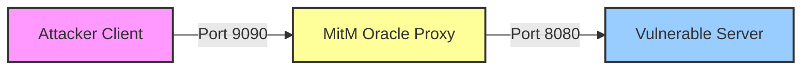

# ML-KEM-768 (Kyber) Side-Channel Analysis: MitM Oracle Attack
## Course: Advanced Network Security / Applied Cryptography
### Project: Vulnerability Reproduction & Protocol Analysis

---

## 1. Project Abstract

This project demonstrates a **Chosen Ciphertext Attack (CCA)** against the **ML-KEM-768 (FIPS 203)** post-quantum standard. By exploiting an implementation flaw where the **Implicit Rejection** mechanism is disabled, we transform the target server into a **Decryption Oracle**.

Unlike standard local exploits, this demonstration introduces a **Man-in-the-Middle (MitM)** architecture. We implement a transparent TCP proxy to intercept chosen ciphertexts and capture the leaked shared secrets in transit, simulating a realistic network-layer adversary (e.g., a compromised edge router or TLS termination proxy).

---

## 2. System Architecture & Threat Model

The experimental setup simulates a network environment where the attacker does not have direct access to the server's memory or logs but controls the network path.

### 2.1 Component Interaction



### 2.2 Roles

1.  **Attacker (Client):**
    * Constructs specific "Zero Vector" ciphertexts.
    * Performs offline cryptanalysis using a Rainbow Table to recover the private key coefficient $s[0]$.
2.  **MitM Oracle (Proxy):**
    * Transparently forwards TCP traffic.
    * Passively observes the stream to identify ciphertext payloads ($1088$ bytes) and leaked secrets ($32$ bytes).
    * Demonstrates that the leakage is visible on the wire.
3.  **Vulnerable Server:**
    * Hosts the ML-KEM-768 Private Key.
    * Contains the specific vulnerability: **Bypassed Fujisaki-Okamoto (FO) integrity check**.

---

## 3. Prerequisites

* **Operating System:** Linux (Ubuntu 20.04+ recommended) or WSL2.
* **Build Tools:** `gcc`, `make`.
* **Scripting:** Python 3.8+ (Standard libraries only).
* **Cryptography Library:** `PQClean` (Reference implementation).

---

## 4. Environment Setup

### Step 1: Clone the Reference Repository
Download the standard implementation of post-quantum algorithms.

```bash
git clone https://github.com/PQClean/PQClean.git
cd PQClean
```

### Step 2: Inject the Cryptographic Vulnerability
To simulate the implementation flaw, we must manually disable the integrity check in the library source code. This forces the server to process invalid ciphertexts instead of rejecting them.

* **Target File:** `crypto_kem/ml-kem-768/clean/kem.c`
* **Function:** `PQCLEAN_MLKEM768_CLEAN_crypto_kem_dec`

**Modification:**
Locate the validation logic (approx. line 150) and force the failure flag to zero.

```c
/* crypto_kem/ml-kem-768/clean/kem.c */

// ... inside decapsulation function ...

// 1. Re-encrypt to verify integrity (FO-Transform)
PQCLEAN_MLKEM768_CLEAN_indcpa_enc(cmp, buf, pk, kr + KYBER_SYMBYTES);

/* --- VULNERABILITY INJECTION START --- */

// ORIGINAL CODE (Secure):
// fail = PQCLEAN_MLKEM768_CLEAN_verify(ct, cmp, KYBER_CIPHERTEXTBYTES);

// MODIFIED CODE (Vulnerable):
fail = 0;  // Force server to accept invalid ciphertext

/* --- VULNERABILITY INJECTION END --- */

// The server now derives the shared secret from the invalid ciphertext
// rather than returning a random value.
```

### Step 3: Deploy Project Files
Copy the provided project files into the `PQClean` root directory:
* `Makefile`
* `mitm_oracle.c`
* `server_auto.c`
* `auto_exploit.py`

### Step 4: Compilation
Use the provided `Makefile` to build the Server and the MitM Proxy.

```bash
make all
```
* *Output:* Generates binary executables `vuln_server` and `mitm_oracle`.

---

## 5. Demonstration Procedure

Open three separate terminal windows to simulate the distinct network entities.

### Terminal 1: Vulnerable Server
The server initializes the keypair and listens on port **8080**.

```bash
./vuln_server
```
> *Status: Server is running and waiting for connections.*

### Terminal 2: MitM Oracle Proxy
The proxy listens on port **9090** and forwards traffic to the server (8080). This terminal acts as the "Network Tap."

```bash
./mitm_oracle 127.0.0.1:8080 9090
```
> *Status: Proxy initialized. Watching for Kyber payloads...*

### Terminal 3: Attacker
The attack script connects to the **Proxy (9090)**, causing traffic to flow through the MitM node.

```bash
python3 auto_exploit.py
```

---

## 6. Expected Results & Analysis

### 1. Network Observation (Terminal 2)
As the attack executes, the MitM console will display:
* **[Oracle] Chosen Ciphertext Detected:** Confirms the injection of the malicious zero-vector.
* **[Leak] Shared Secret Observed:** Displays the 32-byte hex string leaked by the server. 
* *Academic Note:* This proves that the lack of Implicit Rejection allows the internal state to leak onto the public network.

### 2. Key Recovery (Terminal 3)
The Python script will perform pattern matching:
* It captures the leaked secret from the network stream.
* It compares the leak against the pre-loaded Rainbow Table.
* **Result:** `[CRITICAL MATCH CONFIRMED] PRIVATE KEY COEFFICIENT s[0] IDENTIFIED`.

---

## 7. Technical Conclusion

This experiment validates that **IND-CCA security** is not merely a theoretical requirement but a practical necessity for network security. 

By removing the FO-Transform check, the KEM degrades to IND-CPA. In a network setting, this allows a MitM adversary to utilize the server as a **Decryption Oracle**, recovering the private key one coefficient at a time without ever accessing the server's filesystem.