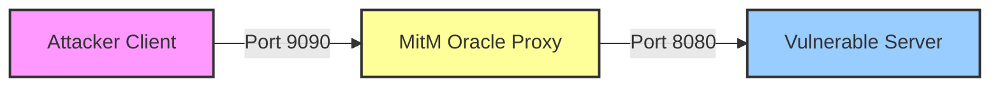

# ML-KEM-768 (Kyber) Side-Channel Analysis: MitM Oracle Attack

## Course: Cryptography

### Project: Vulnerability Reproduction & Protocol Analysis

-----

## 1\. Project Abstract

This project demonstrates a **Chosen Ciphertext Attack (CCA)** against the **ML-KEM-768 (FIPS 203)** post-quantum standard. By exploiting an implementation flaw where the **Implicit Rejection** mechanism is disabled, we transform the target server into a **Decryption Oracle**.

Unlike standard local exploits, this demonstration introduces a **Man-in-the-Middle (MitM)** architecture. Furthermore, we employ a **Persistent Key** methodology to scientifically validate the vulnerability. By forcing the server to use the same Private Key across restarts, we establish a rigorous comparison between the "Vulnerable" (Experiment) and "Secure" (Control) states.

-----

## 2\. System Architecture & Threat Model

The experimental setup simulates a network environment where the attacker does not have direct access to the server's memory or logs but controls the network path.

### 2.1 Component Interaction



### 2.2 Roles

1.  **Attacker (Client):**
      * Constructs specific "Zero Vector" ciphertexts.
      * Calibrates against the target to identify the "Vulnerable Fingerprint."
      * Validates whether the server is leaking the key or behaving securely.
2.  **MitM Oracle (Proxy):**
      * Transparently forwards TCP traffic.
      * Passively observes the stream to identify ciphertext payloads ($1088$ bytes) and leaked secrets ($32$ bytes).
3.  **Target Server:**
      * Hosts the ML-KEM-768 Private Key (persisted in `server_sk.bin`).
      * **State A (Vulnerable):** Fujisaki-Okamoto check disabled (`fail = 0`).
      * **State B (Secure):** Fujisaki-Okamoto check enabled (`fail = verify(...)`).

-----

## 3\. Prerequisites

  * **Operating System:** Linux (Ubuntu 20.04+ recommended) or WSL2.
  * **Build Tools:** `gcc`, `make`, `sed`.
  * **Scripting:** Python 3.8+, Bash.
  * **Cryptography Library:** `PQClean` (Reference implementation).

-----

## 4\. Environment Setup

### Step 1: Clone the Reference Repository

Download the standard implementation of post-quantum algorithms.

```bash
git clone https://github.com/PQClean/PQClean.git
cd PQClean
```

### Step 2: Deploy Project Files

Copy the provided project files into a working directory (e.g., `CCA_PoC/`):

  * `Makefile`
  * `mitm_oracle.c`
  * `server_auto.c`
  * `auto_exploit.py`
  * `switch_mode.sh` (Automated Configuration Script)

### Step 3: Initialization

Before starting the demonstration, ensure the environment is clean and no old keys exist.

```bash
make distclean
```

  * *Action:* Removes executables and deletes `server_sk.bin` (if any).

-----

## 5\. Demonstration Procedure

Open three separate terminal windows to simulate the distinct network entities.

### Phase 1: Calibration & Attack (The Vulnerability)

**Goal:** Configure the server to be vulnerable, generate a new key, and calibrate the attack script.

**1. Terminal 1 (Server Side): Enable Vulnerability**
Use the helper script to inject the fault and compile.

```bash
bash switch_mode.sh vuln
./vuln_server
```

> Output:
> `[System] Switching to VULNERABLE mode...`
> `[Init] First Run: Generating NEW Keypair and saving to 'server_sk.bin'...`
> `[Init] Vulnerable Server listening on port 8080...`

**2. Terminal 2 (Proxy): Start MitM**

```bash
./mitm_oracle 127.0.0.1:8080 9090
```

**3. Terminal 3 (Attacker): Calibration**
Run the attack script. It will fail initially but trigger the server to leak the hash.

```bash
python3 auto_exploit.py
```

**4. Capture the Hash**
Look at **Terminal 1 (Server)**. You will see a debug message:

> `[DEBUG] Calculated Shared Secret: d99dab58... (example)`

Copy this hash string. Open `auto_exploit.py` and update the configuration:

```python
# auto_exploit.py
VULNERABLE_HASH = "d99dab58..." # Paste the real hash here
```

**5. Execute Attack**
Run the script again in Terminal 3.

```bash
python3 auto_exploit.py
```

> **Result:** `[SUCCESS] VULNERABILITY EXPLOITED!`
> The script confirms the server returned the deterministic leak associated with the private key.

-----

### Phase 2: Defense Validation (The Control)

**Goal:** Fix the server code *without* changing the private key, proving that the Implicit Rejection mechanism mitigates the attack.

**1. Terminal 1 (Server Side): Enable Security**
Stop the server (Ctrl+C). Use the script to restore the FO-Transform check.
**IMPORTANT:** Do NOT run `make distclean`. We must keep `server_sk.bin`.

```bash
bash switch_mode.sh secure
./vuln_server
```

> Output:
> `[System] Switching to SECURE mode...`
> `[Init] Persistence: Loading existing Private Key from 'server_sk.bin'...`
> *Note: The server is now using the SAME key as Phase 1.*

**2. Terminal 3 (Attacker): Re-Attempt Attack**
Run the attack script again. The Python script still expects the "Vulnerable Hash" from Phase 1.

```bash
python3 auto_exploit.py
```

**3. Analyze Result**
The server detects the invalid ciphertext (Zero Vector) via the FO-Transform and returns a pseudo-random value instead of the leaked hash.

> **Result:** `[FAILED] ATTACK MITIGATED.`
> `[CONCLUSION] Implicit Rejection (FO-Transform) is ACTIVE and SECURE.`

-----

## 6\. Technical Analysis

### Why did the output change?

1.  **Vulnerable Mode:** The server blindly decapsulated the Zero Vector using the Private Key, resulting in a mathematical artifact ($H_{vuln}$).
2.  **Secure Mode:** The server re-encrypted the decapsulated message, compared it with the input ciphertext, found a mismatch, and returned a deterministic random value ($H_{secure}$) derived from the rejection seed.

### Conclusion

This experiment validates that **IND-CCA security** is not merely a theoretical requirement but a practical necessity. By removing the FO-Transform check, the KEM degrades to IND-CPA, allowing an adversary to utilize the server as a **Decryption Oracle**. Restoring the check effectively neutralizes the oracle without requiring key revocation.